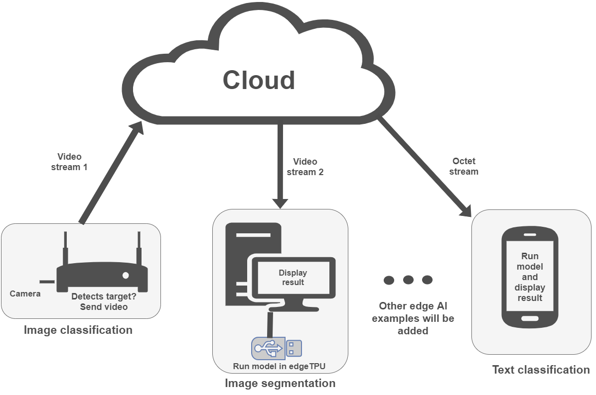

---
title: Edge-AI
...

# What is Edge-AI?
Currently, the heavy computing capacity required to run deep learning models necessitates that the majority of AI processes be carried out in the cloud.

However, running AI in the cloud has its disadvantages, including the fact that it requires an internet connection, and that performance can be impacted by bandwidth and latency limitations.

Edge AI, also known as ‘on-device AI’, is a distributed computing paradigm that allows for AI algorithms to be run locally on a device, using the data produced by that device.

Running AI at the ‘edge’ of the local network removes the requirement for the device to be connected to the internet or centralized servers like the cloud.

Edge AI offers significant improvements as far as response speeds and data security.

Executing AI close to the data source allows for processes like data creation and decision-making to take place in milliseconds, making Edge AI ideal for applications where near-instantaneous responses are essential.

  * Reference : [On the Edge - How Edge AI is reshaping the future](https://www.samsung.com/semiconductor/newsroom/tech-trends/on-the-edge-how-edge-ai-is-reshaping-the-future/)

# Edge-AI Example Applications with NNStreamer
Note : If you are new to NNStreamer, see [usage examples screenshots](https://github.com/nnstreamer/nnstreamer/wiki/usage-examples-screenshots).

Example shows how to implement edge AI using NNStreamer.

These examples are tested using Ubuntu PC and Raspberry PI.

  * [Image Classification](https://github.com/nnstreamer/nnstreamer-example/tree/master/Tizen.platform/Tizen_IoT_ImageClassification)

    The device analyzes the camera image before transmitting it, and then transmits meaningful information only.

    In this example, if the device finds a target that the user wants, it starts video streaming to the server.
  * [Text Classification](https://github.com/nnstreamer/nnstreamer-example/tree/master/Tizen.platform/Tizen_IoT_text_classification_NonGUI)

    Text classifications are classified into predefined groups based on sentences.

  * [Image segmentation on edgeTPU](https://github.com/nnstreamer/nnstreamer-example/tree/master/bash_script/example_image_segmentation_tensorflow_lite)

    Image segmentation is the process of partitioning a digital image into multiple segments.

    This application shows how to send the flatbuf to the edge device and run inferences on the edgeTPU.

### High level deployment diagram of NNStreamer edge-AI examples

*To help understand the three edge-AI examples, it would be different from the actual.
