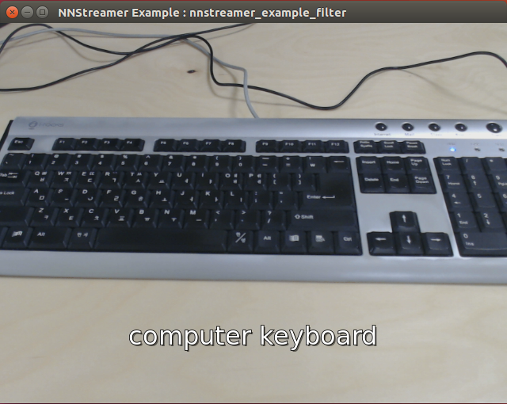
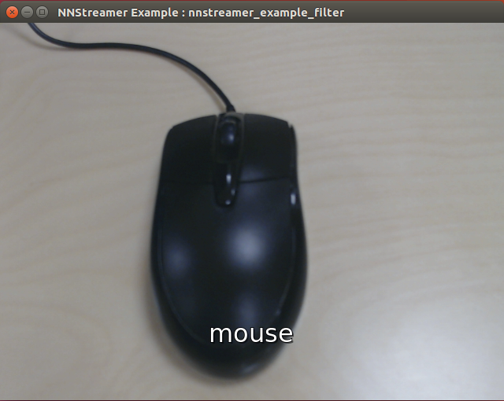
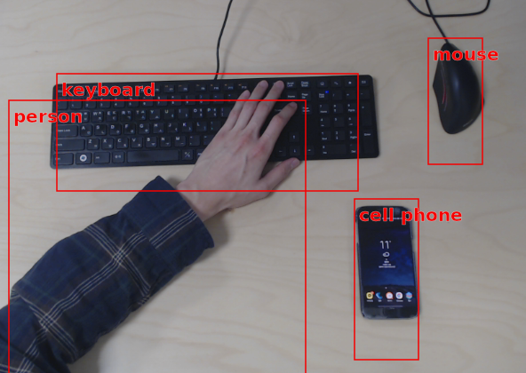
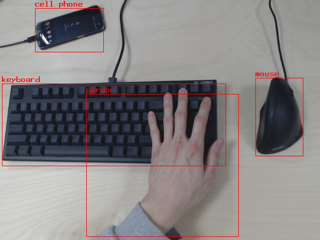
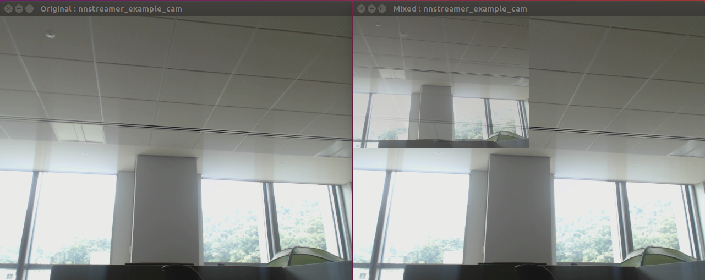

---
title: How to run examples
...

## Note: More examples can be found here. [nnstreamer-example](https://github.com/nnstreamer/nnstreamer-example)

# Table of Contents
* [Preparing nnstreamer for execution](#preparing-nnstreamer-for-execution)
  * [Use PPA](#use-ppa)
  * [Build examples (Ubuntu 16.04)](#build-examples-ubuntu-1604-and-1804)
* [Usage Examples](#usage-examples)
  * [Example : camera live-view image classification. w/ gst-launch, decoded by tensor_decoder](#example-camera-liveview-image-classification-w-gstlaunch-decoded-by-tensor_decoder)
  * [Example : camera live-view image classification, decoded by user application](#example-camera-liveview-image-classification-decoded-by-user-application)
  * [Example : camera live-view object detection, decoded by user application with Tensorflow-Lite](#example-camera-liveview-object-detection-decoded-by-user-application-with-tensorflowlite)
  * [Example : camera live-view object detection, decoded by user application with Tensorflow](#example-camera-liveview-object-detection-decoded-by-user-application-with-tensorflow)
  * [Example : video mixer with NNStreamer plug-in](#example-video-mixer-with-nnstreamer-plugin)
  * [Example : tensor sink](#example-tensor-sink)


# Preparing nnstreamer for execution.
## Use PPA

If you don't mind building binaries, you can directly download from PPA with daily releases:
* Download nnstreamer :
```
$ sudo add-apt-repository ppa:nnstreamer/ppa
$ sudo apt-get update
$ sudo apt-get install nnstreamer
```
Note that this may install tensorflow packaged by us.

* Download nnstreamer example :
```
$ sudo add-apt-repository ppa:nnstreamer-example/ppa
$ sudo apt-get update
$ sudo apt-get install nnstreamer-example
$ cd /usr/lib/nnstreamer/bin
```

As of 2018/10/13, we support 16.04 and 18.04

## Build examples (Ubuntu 16.04 and 18.04)
* https://github.com/nnstreamer/nnstreamer/blob/main/Documentation/getting-started.md

- Install related packages before building nnstreamer and examples.
1. ninja-build, meson (>=0.50)
2. liborc (>=0.4.25, optional)
3. tensorflow, protobuf (>=3.6.1)
4. tensorflow-lite

- Build options (meson)
  * You can find the option definitions here: [meson options](https://github.com/nnstreamer/nnstreamer/blob/main/meson_options.txt)
  * For more information about meson build options itself, see [here](https://mesonbuild.com/Build-options.html).

  For example, to build and install NNStreamer by disabling tensorflow2-lite,
   ```
   $ meson --prefix=${NNST_ROOT} --sysconfdir=${NNST_ROOT} --libdir=lib --bindir=bin --includedir=include -Dtflite2-support=disabled build
   ```

- Build source code
```
# Install packages for python example
$ sudo apt-get install python-gi python3-gi
$ sudo apt-get install python-gst-1.0 python3-gst-1.0
$ sudo apt-get install python-gst-1.0-dbg python3-gst-1.0-dbg

# Set your own path to install libraries and header files
$ sudo vi ~/.bashrc

export NNST_ROOT=$HOME/nnstreamer
export LD_LIBRARY_PATH=$LD_LIBRARY_PATH:$NNST_ROOT/lib
export GST_PLUGIN_PATH=$GST_PLUGIN_PATH:$NNST_ROOT/lib/gstreamer-1.0
# Include NNStreamer headers and libraries
export C_INCLUDE_PATH=$C_INCLUDE_PATH:$NNST_ROOT/include
export CPLUS_INCLUDE_PATH=$CPLUS_INCLUDE_PATH:$NNST_ROOT/include
export PKG_CONFIG_PATH=$PKG_CONFIG_PATH:$NNST_ROOT/lib/pkgconfig

$ source ~/.bashrc

# Download source, then compile it.
# Build and install nnstreamer
$ git clone https://github.com/nnstreamer/nnstreamer.git nnstreamer.git
$ cd nnstreamer.git
$ meson --prefix=${NNST_ROOT} --sysconfdir=${NNST_ROOT} --libdir=lib --bindir=bin --includedir=include build
$ ninja -C build install
$ cd ..

# Build and install examples
$ git clone https://github.com/nnstreamer/nnstreamer-example.git nnstreamer-example.git
$ cd nnstreamer-example.git
$ meson --prefix=${NNST_ROOT} --libdir=lib --bindir=bin --includedir=include build
$ ninja -C build install
$ rm -rf build
$ cd ..
```

- Download tensorflow-lite model & labels.
```
$ cd $NNST_ROOT/bin/
$ ./get-model.sh image-classification-tflite # for the example image classification
$ ./get-model.sh object-detection-tflite # for the example object detection
```

***

# Usage Examples

## Example : camera live-view image classification. w/ gst-launch, decoded by tensor_decoder

```
$ cd $NNST_ROOT/bin/
$ gst-launch-1.0 textoverlay name=overlay font-desc="Sans, 26" ! \
    videoconvert ! ximagesink name=img_test \
    v4l2src name=cam_src ! videoconvert ! videoscale ! video/x-raw,width=640,height=480,format=RGB ! \
    tee name=t_raw \
    t_raw. ! queue ! overlay.video_sink \
    t_raw. ! queue ! videoscale ! video/x-raw,width=224,height=224 ! \
    tensor_converter ! \
    tensor_filter framework=tensorflow-lite \
    model=tflite_model_img/mobilenet_v1_1.0_224_quant.tflite ! \
    tensor_decoder mode=image_labeling \
    option1=tflite_model_img/labels.txt ! \
    overlay.text_sink
```

The stream pipeline in this example is:
```
[CAM] - [videoconvert] - [videoscale] - [tee] -+- [queue] - [videoscale] - [tensor_converter] - [tensor_filter] - [tensor_decoder] -+- [textoverlay] - [videoconvert] - [ximagesink]
                                               +- [queue] --------------------------------------------------------------------------+
```

The same stream pipeline implementation with C-API is at ```nnstreamer-example.git/native/example_decoder_image_labelling/```


## Example : camera live-view image classification, decoded by user application.

```
[CAM] - [videoconvert] - [videoscale] - [tee] -+- [queue] - [textoverlay] - [videoconvert] - [ximagesink]
                                               +- [queue] - [videoscale] - [tensor_converter] - [tensor_filter] - [tensor_sink]
```

Displays a video sink.

1. `tensor_filter` for image recognition. (classification with 224x224 image)
2. Example application gets the buffer from `tensor_sink`, then updates recognition result to display in `textoverlay`.

- Run example
```
$ cd $NNST_ROOT/bin/
$ ./nnstreamer_example_image_classification            # run C/C++ example
$ python ./nnstreamer_example_image_classification.py  # run Python example
```

- Screenshot

 

## Example : camera live-view object detection, decoded by user application with Tensorflow-Lite.

```
[CAM] - [videoconvert] - [videoscale] - [tee] -+- [queue] - [videoconvert] - [cairooverlay] - [ximagesink]
                                               +- [queue] - [videoscale] - [tensor_converter] - [tensor_transform] - [tensor_filter] - [tensor_sink]
```

Displays a video sink.

1. `tensor_transform` for typecasting(`uint_8` to `float32`) and regularization of `other/tensor` extracted from the previous element.
2. `tensor_filter` for SSD(Single Shot object Detection). It generates `other/tensors` as the output.
3. Example application gets the buffer from `tensor_sink`, then updates recognition result to display in `cairooverlay`.

- Run example - with execution file
```bash
$ cd $NNST_ROOT/bin/
$ ./nnstreamer_example_object_detection_tflite  # run C/C++ example
```
- Run example - with bash script
```bash
$ cd $NNST_ROOT/bin/
$ ./gst-launch-object-detection-tflite.sh  # run bash script example
```

- Screenshot



## Example : camera live-view object detection, decoded by user application with Tensorflow.

```
[CAM] - [videoconvert] - [videoscale] - [tee] -+- [queue] - [videoconvert] - [cairooverlay] - [ximagesink]
                                               +- [queue] - [videoscale] - [tensor_converter] - [tensor_filter] - [tensor_sink]
```

Displays a video sink.

1. `tensor_filter` for SSD(Single Shot object Detection). It generates `other/tensors` as the output.
2. Example application gets the buffer from `tensor_sink`, then updates recognition result to display in `cairooverlay`.

- Run example - with execution file
```bash
$ cd $NNST_ROOT/bin/
$ ./nnstreamer_example_object_detection_tf  # run C/C++ example
```
- Run example - with bash script
```bash
$ cd $NNST_ROOT/bin/
$ ./gst-launch-object-detection-tf.sh  # run bash script example
```

- Screenshot



## Example : video mixer with NNStreamer plug-in

```
[CAM] - [videoconvert] - [videoscale] - [tee] -+- [queue] -------------------------------------------------------+- [videomixer] - [videoconvert] -- [ximagesink (Mixed)]
                                               +- [queue] - [tensor_converter] - [tensor_decoder] - [videoscale]-+
                                               +- [queue] - [videoconvert] - [ximagesink (Original)]
```

Displays two video sinks,

1. Original from cam
2. Mixed : original + scaled (tensor_converter-tensor_decoder-videoscale)

In pipeline, converter-decoder passes video frame.

- Run example
```
$ cd $NNST_ROOT/bin/
$ ./nnstreamer_example_cam
```

- Screenshot



## Example : tensor sink

Two simple examples to use tensor sink.

#### 1. 100 buffers passed to tensor sink

```
[videotestsrc] - [tensor_converter] - [tensor_sink]
```

Displays nothing, this sample code shows how to get buffer from tensor sink.

- Run example
```
$ cd $NNST_ROOT/bin/
$ ./nnstreamer_sink_example
```

#### 2. launch two pipelines

```
[videotestsrc] - [tensor_converter] - [tensor_sink]
                                                   [appsrc] - [tensor_decoder] - [videoconvert] - [ximagesink]
[push buffer from tensor_sink to appsrc]

```

Displays video sink.

Tensor sink receives buffer and pushes it into appsrc in 2nd pipeline.

- Run example
```
$ cd $NNST_ROOT/bin/
$ ./nnstreamer_sink_example_play
```
