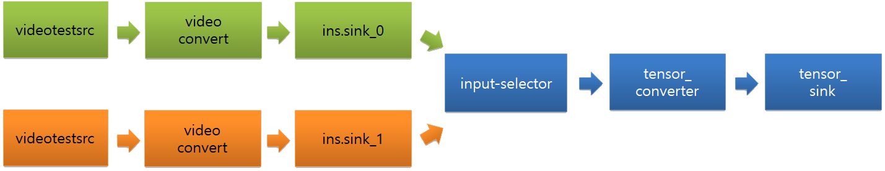
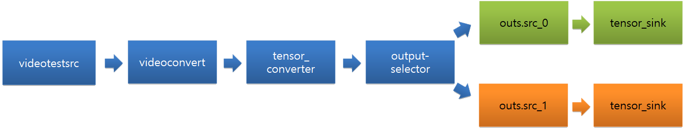

# Machine Learning Inference


You can easily create and efficiently execute data stream pipelines that consist of neural networks as filters in pipelines.

The main features of the Machine Learning Inference API include:

- Construction of data pipeline based on [GStreamer](https://gstreamer.freedesktop.org/)

  You can compose the data stream pipeline through Machine Learning Inference with various elements of GStreamer and NNStreamer.

- [Single](#single-api) API and [Pipeline](#pipeline-api) API
  
  There are two types of Machine Learning Inference API - Single API and Pipeline API.

  Single API is useful for a simple usage scenario of neural network models. It allows invoking a neural network model with a single instance of input data for the model directly. It is useful if you have the input data pre-processed with the application itself and there are no complex interactions between neural network models, data processors, or data stream paths.

  Pipeline API allows developers to construct and execute pipelines with multiple neural network models, multiple inputs and output nodes, multiple data processors, pre-and-post processors, and various data path manipulators. Besides, if the input is online data or streamed data, Pipeline API simplifies your application and improves its performance.

  
- Support various neural network frameworks (NNFW)
  
  TensorFlow, TensorFlow-Lite, Caffe2, and PyTorch are the supported neural network frameworks. Neural network model files trained by such frameworks can be imported as filters of pipelines directly.
  Custom filters, which are neural network models implemented directly with programming languages including C/C++ and Python, maybe imported as filters of pipelines directly as well.

  > **Note**
  >
  > The devices powered by Tizen OS can contain TensorFlow-Lite only. Ensure that the neural network frameworks that you want to use are installed.

## Prerequisites

To enable your application to use the machine learning functionality:

1. To use the functions and data types of the Machine Learning Inference API, include the `<nnstreamer.h>` header file in your application:

   ```c
   #include <nnstreamer.h>
   ```

2. To use the Machine Learning Inference API, include the following features in your `tizen-manifest.xml` file:

   ```xml
   <feature name="http://tizen.org/feature/machine_learning">true</feature>
   <feature name="http://tizen.org/feature/machine_learning.inference">true</feature>
   ```

## Single API

This section shows how to load a model without the construction of pipelines.
 
1. Open a model file:

    ```c
    #include <nnstreamer-single.h>

    ml_single_h single;
    ml_tensors_info_h in_info, out_info;

    ...

    ml_single_open (&single, "model_file_path", in_info, out_info, ML_NNFW_TYPE_TENSORFLOW_LITE, ML_NNFW_HW_ANY);
    ```

    To load a model file, two `ml_tensors_info_h` are required. `in_info` contains the information of the input tensors, and `out_info` contains the information of the output tensors. For more information, see [Tensors Information](#tensors-information).

2. Get the [Tensors Information](#tensors-information).

    After opening the model, use the following functions to bring the information of the input and output tensors:
    ```c
    ml_single_get_input_info (single, &in_info);
    ml_single_get_output_info (single, &out_info);
    ```

3. Invoke the model with input and output [Tensors Data](#tensors-data).

    The model can be invoked with input and output tensors data. The result is included in the output tensors data:
    ```c
    ml_tensors_data_create (in_info, &input);
    ml_single_invoke (single, input, &output);
    ```

4. close the opened handle:

    ```c
    ml_single_close (single);
    ```

## Pipeline API

This section shows how to create a pipeline.

### Basic Usage

1. Construct a pipeline with the GStreamer elements.

    Different pipelines can be constructed using various GStreamer elements:
    ```c
    char pipeline[] = "videotestsrc num_buffers=2 ! videoconvert ! videoscale ! video/x-raw,format=RGBx,width=224,height=224 ! tensor_converter ! fakesink";
    ml_pipeline_h handle;
    int status = ml_pipeline_construct (pipeline, NULL, NULL, &handle);
    ```

2. Start the pipeline and get state:

    ```c
    /* The pipeline could be started when the state is paused */
    status = ml_pipeline_start (handle);
    status = ml_pipeline_get_state (handle, &state);
    ```

3. Stop the pipeline and get state:

    ```c
    status = ml_pipeline_stop (handle);
    status = ml_pipeline_get_state (handle, &state);
    ```

4. Destroy the pipeline.

    When no longer needed, destroy the pipeline:
    ```c
    status = ml_pipeline_destroy (handle);
    ```

### Element API

You need to manipulate the input and the output data to run neural network models with Machine Learning Inference API. In addition, you can construct pipelines that can be controlled.

Followings are the available elements:

- **Source**

    The configuration of the data source element is required to set the input tensor data:
    ```c
    char pipeline[] = "appsrc name=srcx ! other/tensor,dimension=(string)4:1:1:1,type=(string)uint8,framerate=(fraction)0/1 ! tensor_sink";
    ```
    `ml_pipeline_src_get_handle()` controls the `appsrc` element with the name `srcx`:

    ```c
    ml_pipeline_h handle;
    ml_pipeline_src_h srchandle;

    status = ml_pipeline_construct (pipeline, NULL, NULL, &handle);
    status = ml_pipeline_start (handle);
    status = ml_pipeline_src_get_handle (handle, "srcx", &srchandle);
    ```

    You can check the information of input tensors using `srchandle`:

    ```c
    ml_tensors_info_h info;

    status = ml_pipeline_src_get_tensors_info (srchandle, &info);
    ```

    The input tensor data can be filled according to the `info`:
    ```c
    ml_tensors_data_h data;

    status = ml_tensors_data_create (info, &data);

    for (i = 0; i < 10; i++) {
      uintarray1[i] = (uint8_t *) malloc (4);
      uintarray1[i][0] = i + 4;
      uintarray1[i][1] = i + 1;
      uintarray1[i][2] = i + 3;
      uintarray1[i][3] = i + 2;
    }

    status = ml_tensors_data_set_tensor_data (data, 0, uintarray1[0], 4);

    /* Setting the policy of raw data pointer */
    status = ml_pipeline_src_input_data (srchandle, data, ML_PIPELINE_BUF_POLICY_DO_NOT_FREE);
    ```

    After using the data source element, release the handle:

    ```c
    status = ml_pipeline_src_release_handle (srchandle);
    ```

- **Sink**

    The configuration of the data sink element is required to get the output tensor data:
    ```c
    char pipeline[] = "videotestsrc num-buffers=3 ! videoconvert ! tensor_converter ! appsink name=sinkx";
    ```

    `appsink` element with the name `sinkx` becomes reachable through `ml_pipeline_sink_register()`:
    ```c
    int status;
    ml_pipeline_h handle;
    ml_pipeline_sink_h sinkhandle;

    status = ml_pipeline_sink_register (handle, "sinkx", sink_callback, user_data, &sinkhandle);
    ```

    You can get the data from `sink_callback()`, whenever `appsink` named `sinkx` receives data:
    ```c
    typedef void (*ml_pipeline_sink_cb) (const ml_tensors_data_h data, const ml_tensors_info_h info, void *user_data);
    ```

    Release the `sinkhandle` through `ml_pipeline_sink_unregister()`:
    ```c
    status = ml_pipeline_sink_unregister (sinkhandle);
    ```

- **Valve**

    This element is used to control the stream of a pipeline:
    ```c
    char pipeline[] = "videotestsrc is-live=true ! videoconvert ! videoscale ! video/x-raw,format=RGBx,width=16,height=16,framerate=10/1 ! tensor_converter ! valve name=valve1 ! fakesink";
    int status = ml_pipeline_construct (pipeline, NULL, NULL, &handle);
    ```

    By default, valve named `valve1` of the pipeline is opened. You can control the valve using `ml_pipeline_valve_h`:
    ```c
    ml_pipeline_h handle;
    ml_pipeline_valve_h valve1;

    status = ml_pipeline_valve_get_handle (handle, "valve1", &valve1);
    ```

    After you start a pipeline, you can control the stream of the pipeline with a valve:
    ```c
    status = ml_pipeline_start (handle);

    status = ml_pipeline_valve_set_open (valve1, false); /* Close */
    ```

    You can also open the pipeline by controlling the stream of a pipeline with a valve:
    ```c
    status = ml_pipeline_valve_set_open (valve1, true); /* Open */
    ```

    Before you destroy the pipeline, release `ml_pipeline_valve_h`:
    ```c
    status = ml_pipeline_valve_release_handle (valve1); /* Release valve handle */
    ```

- **Switch**

    The switch element is used when you need only one working branch from a pipeline that has multiple branches:

    

    ```c
    char pipeline[] = "input-selector name=ins ! tensor_converter ! tensor_sink name=sinkx videotestsrc is-live=true ! videoconvert ! ins.sink_0 videotestsrc num-buffers=3 is-live=true ! videoconvert ! ins.sink_1";
    ```

    Get `ml_pipeline_switch_h`. The name of the switch in this pipeline is `ins`:
    ```c
    ml_pipeline_h handle;
    ml_pipeline_switch_h switchhandle;
    ml_pipeline_switch_e type;

    status = ml_pipeline_construct (pipeline, NULL, NULL, &handle);
    status = ml_pipeline_switch_get_handle (handle, "ins", &type, &switchhandle);
    ```

    You can control the switch using the handle `ml_pipeline_switch_h`:
    ```c
    status = ml_pipeline_switch_select (switchhandle, "sink_1");
    ```

    Before you destroy the pipeline, release `ml_pipeline_switch_h`:
    ```c
    status = ml_pipeline_switch_release_handle (switchhandle);
    ```

    The following image shows the switch at the end of the pipeline:

    

    ```c
    char pipeline[] = "videotestsrc is-live=true ! videoconvert ! tensor_converter ! output-selector name=outs outs.src_0 ! tensor_sink name=sink0 async=false outs.src_1 ! tensor_sink name=sink1 async=false"
    ```

### Pipeline States

For more information about the pipeline states, see [GStreamer guide](https://gstreamer.freedesktop.org/documentation/plugin-development/basics/states.html).

## Tensors Information

`ml_tensors_info_h` contains the information of tensors. The tensor info can be managed using the following functions:

- **Create and destroy**
    ```c
    ml_tensors_info_h info;
    status = ml_tensors_info_create (&info);
    status = ml_tensors_info_destroy (info);
    ```

- **Set functions**
    ```c
    /* Set how many tensors exist */
    status = ml_tensors_info_set_count (info, 1);

    /* Set the type of the tensor_0 as UINT8 */
    status = ml_tensors_info_set_tensor_type (info, 0, ML_TENSOR_TYPE_UINT8);

    /* Set the dimension of the tensor_0 as in_dim */
    status = ml_tensors_info_set_tensor_dimension (info, 0, in_dim);

    /* Set the name of the tensor_0 as "tensor-name-test" */
    status = ml_tensors_info_set_tensor_name (info, 0, "tensor-name-test");
    ```

- **Get functions**
    ```c
    /* Get how many tensors exist */
    status = ml_tensors_info_get_count (info, &num);

    /* Get the type of the tensor_0 */
    status = ml_tensors_info_get_tensor_type (info, 0, &out_type);

    /* Get the dimension of the tensor_0 */
    status = ml_tensors_info_get_tensor_dimension (info, 0, in_dim);

    /* Get the name of the tensor_0 */
    status = ml_tensors_info_get_tensor_name (info, 0, &out_name);

    /* Get the size of the tensor_0 */
    status = ml_tensors_info_get_tensor_size (info, 0, &data_size);
    ```

## Tensors Data

`ml_tensors_data_h` contains the raw data of tensors. The tensor data can be managed using the following functions:

- **Create and destroy**
    ```c
    ml_tensors_data_h data;
    ml_tensors_info_h info;

    status = ml_tensors_data_create (info, &data);
    status = ml_tensors_data_destroy (data);
    ```

- **Get and set tensor data**
    ```c
    /* Get tensor data */
    void *data_ptr;
    size_t data_size;
    status = ml_tensors_data_get_tensor_data (data, 0, &data_ptr, &data_size);

    /* Set tensor data */
    uint8_t dummy[4] = {1, 1, 1, 1};
    status = ml_tensors_data_set_tensor_data (data, 0, dummy, 1);
    ```

## Related Information

- Dependencies
  - Tizen 5.5 and Higher for Mobile
  - Tizen 5.5 and Higher for Wearable
