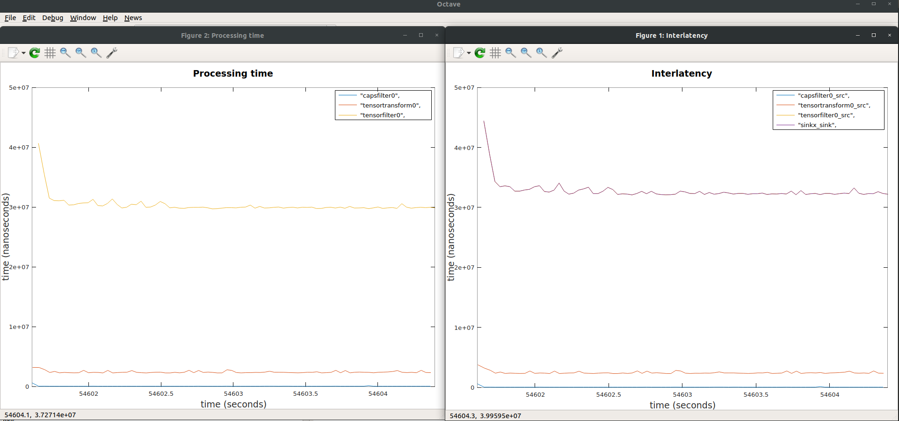

---
title: Profiling Android NNStreamer Pipeline with GstShark
...

# [Android] Profiling NNStreamer Pipeline with GstShark

## Prerequisite

1. You need to build NNStreamer API library with tracing. Please refer [getting-started-android.md](getting-started-android.md).
2. Run Your Android Application with "tracing enabled" NNStreamer API library
3. Install [GStreamer](https://gstreamer.freedesktop.org/documentation/installing/on-linux.html).
4. Install [GstShark](https://github.com/RidgeRun/gst-shark). Please refer [this link](https://developer.ridgerun.com/wiki/index.php?title=GstShark_-_Getting_Started).

## Get the tracing data of your Android Application

1. The tracing data is saved in the application directory of the App. You can get the file (named "datastream") with this commands:

    ```bash
    $ mkdir tracing_data
    $ adb shell "run-as PACKAGE.NAME.OF.APP cat files/datastream > /data/local/tmp/datastream"
    $ adb pull /data/local/tmp/datastream tracing_data/datastream
    ```

2. And you should make the metadata. Currently the metadata is not properly created in the Android device. So you have to make one on your own. It can be made with simple gstreamer pipeline on the shell:

    ```bash
    $ GST_SHARK_LOCATION=/path/to/gst-shark-output/ GST_DEBUG="GST_TRACER:7" GST_TRACERS="interlatency;proctime" gst-launch-1.0 videotestsrc num-buffers=10 ! fakesink
    $ cp /path/to/gst-shark-output/metadata tracing_data/metadata
    ```

## Plotting the tracing data with gstshark-plot

You can check [interlatency](https://developer.ridgerun.com/wiki/index.php?title=GstShark_-_InterLatency_tracer) and [proctime](https://developer.ridgerun.com/wiki/index.php?title=GstShark_-_Processing_Time_tracer) of each element in your pipeline.

```bash
$ gst-shark/scripts/graphics/gstshark-plot tracing_data/ -p
```

An Example:



The plot is from this simple NNStreamer pipeline:
```console
appsrc name=srcx !
    other/tensor,dimension=(string)3:224:224:1,type=(string)uint8,framerate=(fraction)0/1 !
    tensor_transform mode=arithmetic option=typecast:float32,add:-127.5,div:127.5 !
    tensor_filter framework=tensorflow-lite model="path/to/model/" !
    tensor_sink name=sinkx
```
