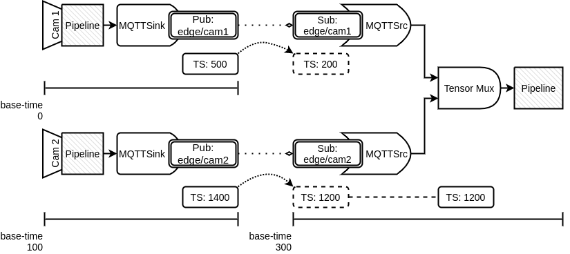

# Synchronization in the MQTT elements

## Background

The base-time of a G/NNStreamer pipeline is a specific moment when it goes to the PLAYING state. To represent the base-time, GStreamer uses the absolute-time based on one of the clocks monotonically increasing in the system. On the other hand, the pipeline's running-time is the total time spent in the PLAYING state and represented as the difference between the base-time and any other absolute-time. Therefore, synchronization in G/NNStreamer is about making sure that a buffer with a certain running-time (i.e., a buffer's timestamp) is played when the clock reaches the same running-time.

## Synchronization of the buffer's running-time across the devices

Since all G/NNStreamer elements in the pipeline have the same clock and base-time, it is possible to easily synchronize the buffers' timestamps with the pipeline clock regardless of the incoming stream's complexity. However, to synchronize the timestamp of a buffer spanning the multiple pipelines that have different base-times, a universal clock is required. In the current implementation of the MQTT elements, we have addressed this issue by embedding the base-time converted to the epoch time (that is, the universal time) into the message header.

The following figure shows three pipelines running on the different devices. The two pipelines on the left side publish images from the cameras to the MQTT topics named ```edge/cam1``` and ```edge/cam2```, respectively, using the MQTTSink elements. The pipeline on the right side, on the other hand, subscribe to the topics, ```edge/cam1``` and ```edge/cam2```, by exploiting the MQTTSrc elements. The [GstBuffer](https://gstreamer.freedesktop.org/documentation/gstreamer/gstbuffer.html?gi-language=c)s (i.e., the image frames) are also shown under each pipeline with its base-time and timestamp (represented as TS). Note that the base-times of the pipelines are different from each other. In this example, it is assumed for representation convenience that the devices' base-times are synchronized with a universal time (e.g., NTP or the time of a specific device among them). In the real case, it is required to synchronize the device time with the universal time in advance.



As mentioned above, a buffer's timestamp indicates the pipeline's running time when the buffer should be played. Comparing to the base-time, it is represented as a relative time. For example, in the pipeline that has the base-time of 0, the buffer whose timestamp is 500 (upper left in the figure) should be played at the absolute time, 500. On the other hand, the buffer whose timestamp is 1400 on the lower left in the figure should be played at the absolute time, 1500, since this pipeline has the base-time of 100. In this way, if the base-time of a pipeline is given, we can convert a buffer's timestamp represented as the relative time based on such base-time to the absolute time-based timestamp as well. This is the reason why we include the base-time converted to the universal time (i.e., the epoch time in the current implementation) in addition to the buffers' timestamp.

The timestamp conversion across the devices is shown at the right side of the figure. We can see that the relative time-based timestamps of the buffers from the MQTTSink pipelines are converted to the other timestamps according to the base-time of the MQTTSrc pipeline. In detail, since the base-time is the absolute time, 300, the timestamps of the buffers generated by the MQTTSrc elements in this pipeline should be adjusted based on this base-time. For this reason, 500, the absolute time-based timestamp, of the buffer is converted to 200, and 1400 is converted to 1200 as well.

In summary, the timestamp of a given buffer in the pipeline running on a device can be converted to the absolute time-based timestamp by adding the base-time of the pipeline. If the devices' times have been synchronized with the universal time, it is possible to convert this absolute time-based timestamp to the relative time of the other device's pipeline by subtracting it from the base-time of the target pipeline.

Tensor Mux, a NNStreamer element, is responsible for intra-pipeline buffer synchronization. In the case of the example, the timestamp difference between two buffers from ```edge/cam1``` and ```edge/cam2``` is 1000. At this point, assuming that the time unit is milliseconds and the MQTTSink element would publish the message to ```edge/cam1``` in every 500 milliseconds while the other MQTTSink element would publish in every 1500 milliseconds to ```edge/cam2```, there will be three messages from ```edge/cam1``` per one message from ```edge/cam2```, the Tensor Mux element has two choices.

The first one is to send the buffers downstream as soon as the element receives them. If this policy is applied to our example, the one-second gap will remain even after the Tensor Mux (or we can use Tensor Merge here) element integrates them into one buffer. This is because the data from ```edge/cam2``` are not ready in most cases even though the data from ```edge/cam1``` are ready.

 The second policy is to wait for the slowest buffer. In this case, the Tensor Mux or Merge element tries to wait for the receiving message from ```edge/cam2``` while keeping the recent message from ```edge/cam1```. As a result, the buffer after that element contains the data synchronized with the rate of the messages from ```edge/cam2```.
