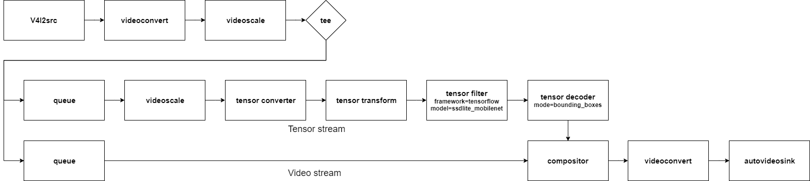

---
title: T2. Object Detection
...

# Tutorial 2. Object detection
This example passes camera video stream to a neural network using tensor_filter.  
Then the given neural network predicts multiple objects with bounding boxes.  


## Prerequisites
```
# install nnstreamer and nnstreamer example
$ sudo add-apt-repository ppa:nnstreamer/ppa
$ sudo apt-get update
$ sudo apt install wget nnstreamer nnstreamer-example nnstreamer-tensorflow2-lite
```

## Run pipeline.
```
# Move to default install directory.
$ cd /usr/lib/nnstreamer/bin
$ gst-launch-1.0 \
    v4l2src ! videoconvert ! videoscale ! video/x-raw,width=640,height=480,format=RGB,framerate=30/1 ! tee name=t \
    t. ! queue leaky=2 max-size-buffers=2 ! videoscale ! video/x-raw,width=300,height=300,format=RGB ! tensor_converter ! \
            tensor_transform mode=arithmetic option=typecast:float32,add:-127.5,div:127.5 ! \
            tensor_filter framework=tensorflow-lite model=tflite_model/ssd_mobilenet_v2_coco.tflite ! \
            tensor_decoder mode=bounding_boxes option1=mobilenet-ssd option2=tflite_model/coco_labels_list.txt option3=tflite_model/box_priors.txt option4=640:480 option5=300:300 ! \
            compositor name=mix sink_0::zorder=2 sink_1::zorder=1 ! videoconvert ! autovideosink \
    t. ! queue leaky=2 max-size-buffers=10 ! mix.
```

If there is any problem running the pipeline, please post the issue [here](https://github.com/nnstreamer/nnstreamer/issues).  
Is the pipeline a little complicated? That's because you're not familiar with the pipeline yet.  
If you follow these tutorials, you will understand well.  


This is a graphical representation of the pipeline. tee divides one input into multiple outputs.  
One flow from the tee is converted into tensor stream (tensor_converter) and tensor filter predicts objects.  
The result of the tensor stream (bounding box) is combined with the video stream and autovideosink displays it.  

Tutorial 2 is the most basic operation of the NNStreamer.  
#### See [here](https://nnstreamer.github.io/nnstreamer-example) for more examples.  
Tutorials 3 and 4 show how to connect between multiple devices. If you only use one device, you may skip next tutorial. If you want to know how to connect between multiple devices, let's go [next](tutorial3_pubsub_mqtt.md).
