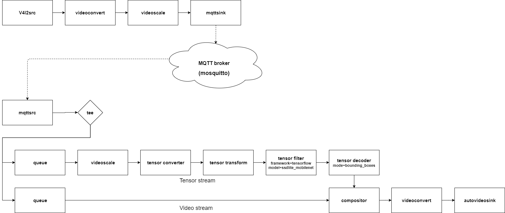

---
title: T3. Edge pipeline - MQTT
...

# Tutorial 3. Edge pipeline - MQTT
The publisher sends a video stream to the broker (in this tutorial, use mosquitto) with the topic designated by the user.  
Subscriber receives video streams from the broker and run object detection.  

## Prerequisites
```
# install mqtt broker
$ sudo apt install mosquitto mosquitto-clients
# install mqtt elements
$ sudo apt install nnstreamer-misc
```

## Run pipeline. (video streaming)
Before starting object detection, let's construct a simple pipeline using mqtt.
### Publisher pipeline.
```
$ gst-launch-1.0 videotestsrc is-live=true ! video/x-raw,format=RGB,width=640,height=480,framerate=5/1 ! mqttsink pub-topic=test/videotestsrc
```
### Subscriber pipeline.
```
$ gst-launch-1.0 mqttsrc sub-topic=test/videotestsrc ! video/x-raw,format=RGB,width=640,height=480,framerate=5/1 ! videoconvert ! ximagesink
```

If you succeeded in streaming the video using mqtt, let's run the object detection.
## Run pipeline. (Object detection)
### Publisher pipeline.
```
$ gst-launch-1.0 v4l2src ! videoconvert ! videoscale ! video/x-raw,format=RGB,width=640,height=480,framerate=5/1 ! mqttsink pub-topic=example/objectDetection
```

### Subscriber pipeline.
```
$ cd /usr/lib/nnstreamer/bin
$ gst-launch-1.0 \
    mqttsrc sub-topic=example/objectDetection ! video/x-raw,format=RGB,width=640,height=480,framerate=5/1 ! tee name=t \
    t. ! queue leaky=2 max-size-buffers=2 ! videoscale ! video/x-raw,width=300,height=300,format=RGB ! tensor_converter ! \
        tensor_transform mode=arithmetic option=typecast:float32,add:-127.5,div:127.5 ! \
        tensor_filter framework=tensorflow-lite model=tflite_model/ssd_mobilenet_v2_coco.tflite ! \
        tensor_decoder mode=bounding_boxes option1=mobilenet-ssd option2=tflite_model/coco_labels_list.txt option3=tflite_model/box_priors.txt option4=640:480 option5=300:300 ! \
        compositor name=mix sink_0::zorder=2 sink_1::zorder=1 ! videoconvert ! ximagesink \
    t. ! queue leaky=2 max-size-buffers=10 ! mix.
```


This is a graphical representation of the pipeline.  
mqttsink publishes incoming data streams with a topic. mqttsrc subscribes the topic and pushes incoming data to the GStreamer pipeline.  
Using mqtt elements, pipelines can operate as data stream publishers or subscribers. This means lightweight device can offload heavy load task to another pipeline with high computing power.  
If you want to receive the offloading results again, use the query. Let's go to the [query](tutorial4_query.md).
