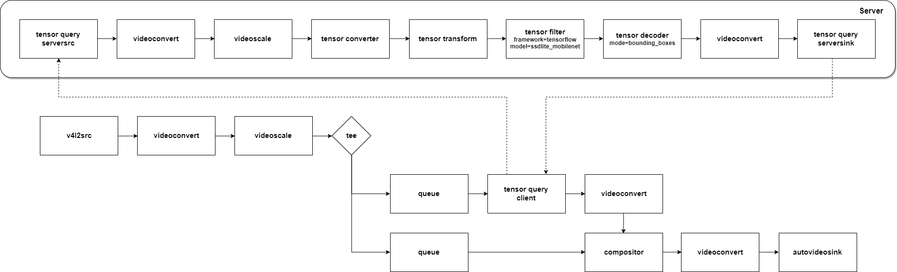

---
title: T4. Edge pipeline - Query
...

# Tutorial 4. Edge pipeline - Query
Tensor query allows devices which have weak AI computational power to use resources from higher-performance devices.  
Suppose you have a device at home with sufficient computing power (server) and a network of lightweight devices connected to it (clients).  
The client asks the server to handle heavy tasks and receives results from the server. Therefore, there is no need for cloud server by running AI on a local network.  
In this tutorial, the client sends a video frame to the server, then the server performs object detection and sends the result to the client.  

## Run pipeline. (echo server)
Before starting object detection, let's construct a simple query pipeline.
### Server pipeline.
```
$ gst-launch-1.0 tensor_query_serversrc ! other/tensors,num_tensors=1,dimensions=3:640:480:1,types=uint8,framerate=30/1 ! tensor_query_serversink
```
### Client pipeline.
```
$ gst-launch-1.0 v4l2src ! videoconvert ! videoscale !  video/x-raw,width=640,height=480,format=RGB,framerate=30/1 ! \
    tensor_converter ! tensor_query_client ! tensor_decoder mode=direct_video ! videoconvert ! ximagesink
```

If you succeeded in streaming the video using query, let's run the object detection.
## Run pipeline. (Object detection)
### Server pipeline.
```
$ cd /usr/lib/nnstreamer/bin
$ gst-launch-1.0 \
    tensor_query_serversrc ! video/x-raw,width=640,height=480,format=RGB,framerate=0/1 ! \
        videoconvert ! videoscale ! video/x-raw,width=300,height=300,format=RGB ! tensor_converter ! \
        tensor_transform mode=arithmetic option=typecast:float32,add:-127.5,div:127.5 ! \
        tensor_filter framework=tensorflow-lite model=tflite_model/ssd_mobilenet_v2_coco.tflite ! \
        tensor_decoder mode=bounding_boxes option1=mobilenet-ssd option2=tflite_model/coco_labels_list.txt option3=tflite_model/box_priors.txt option4=640:480 option5=300:300 ! \
        videoconvert ! tensor_query_serversink
```

### Client pipeline.
```
$ cd /usr/lib/nnstreamer/bin
$ gst-launch-1.0 \
    compositor name=mix sink_0::zorder=2 sink_1::zorder=1 ! videoconvert ! ximagesink \
        v4l2src ! videoconvert ! videoscale ! video/x-raw,width=640,height=480,format=RGB,framerate=10/1 ! tee name=t \
            t. ! queue ! tensor_query_client ! videoconvert ! mix.sink_0 \
            t. ! queue ! mix.sink_1
```


This is a graphical representation of the pipeline.  
Compared to the tutorial 2, only the role of the tensor filter is changed to be performed on the server.  

Tutorial 1 to 4 operated the pipeline using `gst-launch` tools. However, `gst-launch-1.0` is a debugging tool used to simply test pipelines.  
In order to make an application, it is better to use the GStreamer API. Tutorial 5 writes an application using the GStreamer API.
