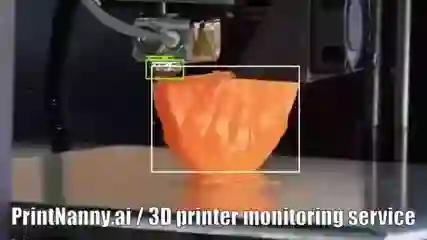

# NNStreamer

[![Gitter][gitter-image]][gitter-url]

Neural Network Support as Gstreamer Plugins.

NNStreamer is a set of Gstreamer plugins that allow
Gstreamer developers to adopt neural network models easily and efficiently and
neural network developers to manage neural network pipelines and their filters easily and efficiently.

[Architectural Description](https://github.com/nnstreamer/nnstreamer/wiki/Architectural-Description) (WIP)   

[Toward Among-Device AI from On-Device AI with Stream Pipelines](https://conf.researchr.org/home/icse-2022), IEEE/ACM ICSE 2022 SEIP  
[NNStreamer: Efficient and Agile Development of On-Device AI Systems](https://ieeexplore.ieee.org/document/9402062), IEEE/ACM ICSE 2021 SEIP [[media](https://youtu.be/HtNXFReF2GY)] 
[NNStreamer: Stream Processing Paradigm for Neural Networks ...](https://arxiv.org/abs/1901.04985) [[pdf/tech report](https://arxiv.org/pdf/1901.04985)] 
[GStreamer Conference 2018, NNStreamer](https://gstreamer.freedesktop.org/conference/2018/talks-and-speakers.html#nnstreamer-neural-networks-as-filters) [[media](https://github.com/nnstreamer/nnstreamer/wiki/Gstreamer-Conference-2018-Presentation-Video)] [[pdf/slides](https://github.com/nnstreamer/nnstreamer/wiki/slides/2018_GSTCON_Ham_181026.pdf)] 
[Naver Tech Talk (Korean), 2018](https://www.facebook.com/naverengineering/posts/2255360384531425) [[media](https://youtu.be/XvXxcnbRjgU)] [[pdf/slides](https://www.slideshare.net/NaverEngineering/nnstreamer-stream-pipeline-for-arbitrary-neural-networks)] 
[Samsung Developer Conference 2019, NNStreamer (media)](https://youtu.be/wVbMbpOjbkw) 
[ResearchGate Page of NNStreamer](https://www.researchgate.net/project/Neural-Network-Streamer-nnstreamer)

## Official Releases

|     | [Tizen](http://download.tizen.org/snapshots/tizen/unified/latest/repos/standard/packages/) | [Ubuntu](https://launchpad.net/~nnstreamer/+archive/ubuntu/ppa) | Android | [Yocto](https://github.com/nnstreamer/meta-neural-network) | macOS |
| :-- | :--: | :--: | :--: | :--: | :--: |
|     | 5.5M2 and later | ~~16.04~~/18.04/20.04/22.04 | 9/P | Kirkstone |   |
| arm |  | Available  | Available| Ready | N/A |
| arm64 |   | Available  |  | Ready | N/A |
| x64 |   |   | Ready  |  | Available |
| x86 |   | N/A  | N/A  | Ready | N/A |
| Publish | [Tizen Repo](http://download.tizen.org/snapshots/tizen/unified/latest/repos/standard/packages/) | [PPA](https://launchpad.net/~nnstreamer/+archive/ubuntu/ppa) | [Daily build](http://ci.nnstreamer.ai/nnstreamer/ci/daily-build/build_result/latest/android/) | [Layer](https://github.com/nnstreamer/meta-neural-network) | [Brew Tap](Documentation/getting-started-macos.md) |
| API | C/C# (Official) | C | Java | C  | C  |

- Ready: CI system ensures build-ability and unit-testing. Users may easily build and execute. However, we do not have automated release & deployment system for this instance.
- Available: binary packages are released and deployed automatically and periodically along with CI tests.
- [Daily Release](http://ci.nnstreamer.ai/nnstreamer/ci/daily-build/build_result/latest/)
- SDK Support: Tizen Studio (5.5 M2+) / Android Studio (JCenter, "nnstreamer")
- [Enabled features of official releases](Documentation/features-per-distro.md)

## Objectives

- Provide neural network framework connectivities (e.g., tensorflow, caffe) for gstreamer streams.
  - **Efficient Streaming for AI Projects**: Apply efficient and flexible stream pipeline to neural networks.
  - **Intelligent Media Filters!**: Use a neural network model as a media filter / converter.
  - **Composite Models!**: Multiple neural network models in a single stream pipeline instance.
  - **Multi Modal Intelligence!**: Multiple sources and stream paths for neural network models.

- Provide easy methods to construct media streams with neural network models using the de-facto-standard media stream framework, **GStreamer**.
  - Gstreamer users: use neural network models as if they are yet another media filters.
  - Neural network developers: manage media streams easily and efficiently.

## Maintainers
* [MyungJoo Ham](https://github.com/myungjoo/)

## Committers
* [Jijoong Moon](https://github.com/jijoongmoon)
* [Geunsik Lim](https://github.com/leemgs)
* [Sangjung Woo](https://github.com/again4you)
* [Wook Song](https://github.com/wooksong)
* [Jaeyun Jung](https://github.com/jaeyun-jung)
* [Hyoungjoo Ahn](https://github.com/helloahn)
* [Parichay Kapoor](https://github.com/kparichay)
* [Dongju Chae](https://github.com/dongju-chae)
* [Gichan Jang](https://github.com/gichan-jang)
* [Yongjoo Ahn](https://github.com/anyj0527)
* [Jihoon Lee](https://github.com/zhoonit)

## Components

Note that this project has just started and many of the components are in design phase.
In [Component Description](Documentation/component-description.md) page, we describe nnstreamer components of the following three categories: data type definitions, gstreamer elements (plugins), and other misc components.

## Getting Started
For more details, please access the following manuals.
* For Linux-like systems such as Tizen, Debian, and Ubuntu, press [here](Documentation/getting-started.md).
* For macOS systems, press [here](Documentation/getting-started-macos.md).
* To build an API library for Android, press [here](Documentation/getting-started-android.md).

## Applications

- [Edge-AI Examples](Documentation/edge-ai.md)
- [Products with NNStreamer](Documentation/products.md)
- NNStreamer example applications: [Github](https://github.com/nnstreamer/nnstreamer-example) / [Screenshots](https://github.com/nnstreamer/nnstreamer/wiki/usage-examples-screenshots)

## CI Server

- [CI service status](http://ci.nnstreamer.ai/)
- [TAOS-CI config files for nnstreamer](.TAOS-CI).

## AI Acceleration Hardware Support

Although a framework may accelerate transparently as Tensorflow-GPU does, nnstreamer provides various hardware acceleration subplugins.
- Movidius-X via ncsdk2 subplugin: Released
- Movidius-X via openVINO subplugin: Released
- Edge-TPU via edgetpu subplugin: Released
- [**ONE**](https://github.com/Samsung/ONE) runtime via nnfw(an old name of **ONE**) subplugin: Released
- ARMNN via armnn subplugin: Released
- Verisilicon-Vivante via vivante subplugin: Released
- Qualcomm SNPE via snpe subplugin: Released
- NVidia via TensorRT subplugin: Released
- TRI-x NPUs: Released
- NXP i.MX series: [via the vendor](https://www.nxp.com/docs/en/user-guide/IMX-MACHINE-LEARNING-UG.pdf)
- Others: TVM, TensorFlow, TensorFlow-lite, PyTorch, Caffe2, SNAP, ...

[gitter-url]: https://gitter.im/nnstreamer/Lobby
[gitter-image]: https://img.shields.io/badge/+%20GITTER-JOIN%20CHAT%20%E2%86%92-1DCE73.svg?style=flat-square

## Contributing

Contributions are welcome! Please see our [Contributing](Documentation/contributing.md) Guide for more details.

