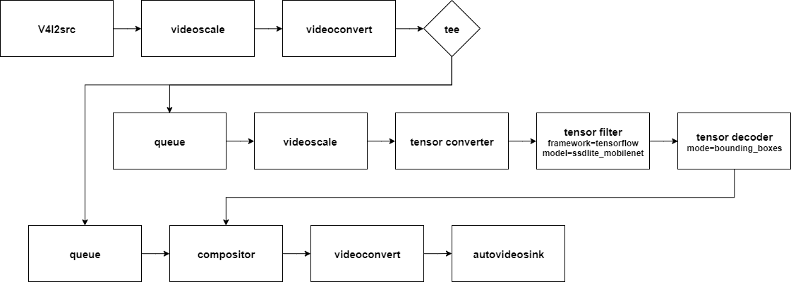
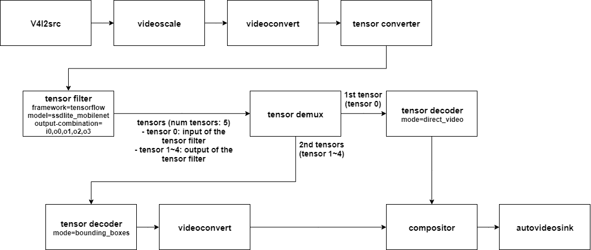

---
title: tensor_filter
...

# NNStreamer::tensor\_filter
This is the main element of the whole NNStreamer project. This connects gstreamer data stream with neural network frameworks (NNFW) such as Tensorflow or Caffe.  
```tensor_filter``` is supposed to attach an instance of neural network model with the given NNFW as a filter to a gstreamer stream.  
The input/output stream data type is either ```other/tensor``` or ```other/tensors```.  
  - With ```other/tensor```, you may push (or pull) a single tensor for an instance of inference for the given model.  
  - With ```other/tensors```, you may push (or pull) multiple tensors for an instance of inference for the given model.  

For example, if the output of a neural network model has two distinctive output tensors, "Bounding boxes, uint32[100][4]" and "Labels, uint32[100]", you may use ```other/tensors``` as the source pad capability to have both tensors in a single frame of the source pad.  
Note that ```tensor_filter``` supports one always source pad and one always sink pad.

## Example launch line (tensorflow)
```
... input other/tensor(s) ! \
    tensor_filter framework=tensorflow model=${PATH_TO_MODEL} \
                  input=784:1 inputtype=float32 inputname=input output=10:1 \
                  outputtype=float32 outputname=softmax ! \
    output other/tensor(s) ! ...
```
You should specify neural network framework, model path, and model meta information.  
More launch line examples here: [nnstreamer example](https://github.com/nnstreamer/nnstreamer-example/tree/master/bash_script)  
*note: If in/out type and dimension can get from the model such as tensorflow-lite, you do not need to specify the properties.

## Supported features
- Multi-tensor
- Custom filters
- Framerate policies
- Recurrent network support
- Supported framework
  - TensorFlow, TensorFlow-lite, NNFW(ONE), Caffe2, Python 3, PyTorch, OpenVINO, EdgeTPU, ArmNN, TensorRT, SNPE, SNAP

## Planned Features
- Timestamp handling

## Known Bugs or Concerns
- No known bugs except for NYI items

## Sink Pads
One always sink pad exists. The capability of sink pad is ```other/tensor``` and ```other/tensors```.  
The number of frames in a buffer is always 1. Although the data semantics of a tensor may have multiple distinct data frames in a single tensor.

## Source Pads
One always source pad exists. The capability of source pad is ```other/tensor``` and ```other/tensors```.  
The number of frames in a buffer is always 1. Although the data semantics of a tensor may have multiple distinct data frames in a single tensor.

## Performance Characteristics
- We do not support in-place operations with tensor\_filter. Actually, with tensor\_filter, in-place operations are considered harmful for the performance and correctness.  
- It is supposed that there is no memcpy from the previous element's source pad to this element's sink or from this element's source to the next element's sink pad.  

## QoS policy
In a nnstreamer pipeline, the QoS is currently satisfied by adjusting input or output framerate, initiated by 'tensor_rate' element.  
When 'tensor_filter' receives a throttling QoS event from the 'tensor_rate' element, it compares the average processing latency and throttling delay, and takes the maximum value as the threshold to drop incoming frames by checking a buffer timestamp.  
In this way, 'tensor filter' can avoid unnecessary calculation and adjust a framerate, effectively reducing resource utilizations.  
Even in the case of receiving QoS events from multiple downstream pipelines (e.g., tee), 'tensor_filter' takes the minimum value as the throttling delay for downstream pipeline with more tight QoS requirement. Lastly, 'tensor_filter' also sends QoS events to upstream elements (e.g., tensor_converter, tensor_src) to possibly reduce incoming framerates, which is a better solution than dropping framerates.  

## In/Out combination
### Input combination
Select the input tensor(s) to invoke the models  
#### Example launch line
```
... (tensors 0,1,2) ! tensor_filter framework=auto model=${MODEL_PATH} input-combination=0,2 ! (output tensor(s) stream) ...
```
If the input is tensors '0,1,2', only tensors '0' and '2' are used to invoke the model

### Output combination
Select the output tensor(s) from the input tensor(s) and/or model output  
#### Example launch line
```
... (tensors 0,1) ! tensor_filter framework=auto model=${MODEL_PATH} output-combination=i0,o0,o2 ! (input tensor 0 and output tensor 0 and 2) ...
```
Suppose the model receives tensors '0,1' as an input and outputs tensor '0,1,2'.  
Src pad of the tensor_filter can produce input tensor '0' and output tensors '0,2' using output-combination.  

### Comparison of tee and combination option
#### Object detection using tee
The video is the same as the original camera output and the labels and bounding boxes are updated after processing in the tensor filter.  
  - launch script
```
gst-launch-1.0 \
v4l2src name=cam_src ! videoscale ! videoconvert ! video/x-raw,width=640,height=480,format=RGB,framerate=30/1 ! tee name=t \
  t. ! queue leaky=2 max-size-buffers=2 ! videoscale ! tensor_converter ! \
    tensor_filter framework=tensorflow model=tf_model/ssdlite_mobilenet_v2.pb \
      input=3:640:480:1 inputname=image_tensor inputtype=uint8 \
      output=1:1:1:1,100:1:1:1,100:1:1:1,4:100:1:1 \
      outputname=num_detections,detection_classes,detection_scores,detection_boxes \
      outputtype=float32,float32,float32,float32 ! \
    tensor_decoder mode=bounding_boxes option1=tf-ssd option2=tf_model/coco_labels_list.txt option4=640:480 option5=640:480 ! \
    compositor name=mix sink_0::zorder=2 sink_1::zorder=1 ! videoconvert ! ximagesink \
  t. ! queue leaky=2 max-size-buffers=10 ! mix.
```
  - Graphical description of the pipeline
    

#### Object detection using output combination option
The orignal video frame is passed to output of tensor-filter using the property output-combination.  
  - launch script
```
gst-launch-1.0 \
v4l2src name=cam_src ! videoscale ! videoconvert ! video/x-raw,width=640,height=480,format=RGB,framerate=30/1 ! \
  tensor_converter ! tensor_filter framework=tensorflow model=tf_model/ssdlite_mobilenet_v2.pb \
      input=3:640:480:1 inputname=image_tensor inputtype=uint8 \
      output=1:1:1:1,100:1:1:1,100:1:1:1,4:100:1:1 \
      outputname=num_detections,detection_classes,detection_scores,detection_boxes \
      outputtype=float32,float32,float32,float32 output-combination=i0,o0,o1,o2,o3 ! \
  tensor_demux name=demux tensorpick=0,1:2:3:4 demux.src_1 ! queue leaky=2 max-size-buffers=2 ! \
    tensor_decoder mode=bounding_boxes option1=tf-ssd option2=tf_model/coco_labels_list.txt option4=640:480 option5=640:480 ! \
    compositor name=mix sink_0::zorder=2 sink_1::zorder=1 ! videoconvert ! ximagesink \
  demux.src_0 ! queue leaky=2 max-size-buffers=2 ! tensor_decoder mode=direct_video ! videoconvert ! mix.
```
  - Graphical description of the pipeline
    

## Sub-Components

### Main ```tensor_filter.c```
This is the main placeholder for all different subcomponents. With the property, ```FRAMEWORK```, this main component loads the proper subcomponent (e.g., tensorflow-lite support, custom support, or other addtional NNFW supports).  
The main component is supposed process the standard properties for subcomponents as well as processing the input/output dimensions.  
The subcomponents as supposed to fill in ```GstTensor_Filter_Framework``` struct and register it with ```supported``` array in ```tensor_filter.h```.  
Note that the registering sturcture may be updated later. (We may follow what ```Linux.kernel/drivers/devfreq/devfreq.c``` does)

### Tensorflow-lite support, ```tensor_filter_tensorflow_lite.cc```
This should fill in ```GstTensor_Filter_Framework``` supporting tensorflow_lite.  

### Custom function support, ```tensor_filter_custom.c```
Neural network and streameline developers may define their own tensor postprocessing operations with tensor_filter_custom.  
With ```nnstreamer-devel``` package installed at build time (e.g., ```BuildRequires: pkgconfig(nnstreamer)``` in .spec file), develerops can implement their own functions and expose their functions via ```NNStreamer_custom_class``` defined in ```tensor_fitler_custom.h```.  
The resulting custom developer plugin should exist as a shared library (.so) with the symbol NNStreamer_custom exposed with all the func defined in NNStreamer_custom_class.  
